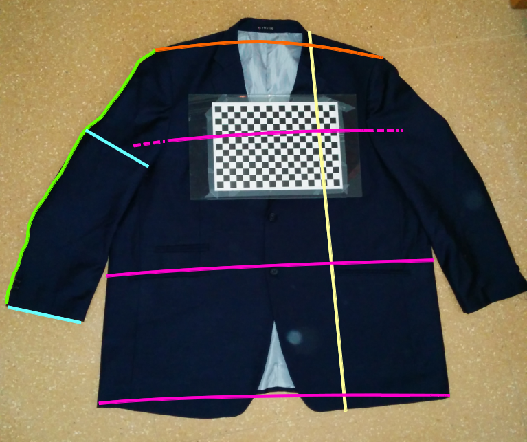

# Visual measurement of jackets by structured prediction

Project in Computer Vision aimed to measure jackets visually.

A classifier performs structured predictions using Conditional Random Fields 
(CRF) and compares with a simple SVM.

The purpose of this project is to verify the following statement:

`An structrured prediction outperforms a simple prediction when data has 
structure`

## Problem
A company sells jackets custom tailored to the sizes specified by their 
clients through its website. Sometimes customers return items complaining they 
don’t fit well.

## Goal
Perform automatic measurements on each garment at pre-shipment time for 
quality control, by means of computer vision techniques

 

## Implementation

In order to measure jacket sizes, a collection of segments are extracted from 
photographs of jackets to feed the classifiers. 

Two distincs classifiers are compared: one aware of structure (SSVM) and 
another that is not (SVM).

- The SVM is fed with the defined segments.
- The SSVM is fed with series of segments (jackets).
